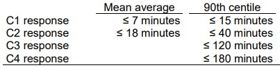

### Acronyms:

- ambsim – legacy shorthand for the ambulance simulation model in this report.
- A&E – accident and emergency
- ADS – ambulance data set
- AQI – ambulance quality indicators
- CAD – computer aided dispatch
- Cat - category
- CM - care model
- Cat2-RT – category 2 mean response time
- dAC – daily ambulance collection
- DART – digital analytics and research team
- DES – discrete event simulation
- DCA/DSV – double crewed ambulance / double staffed vehicle
- ECDS – emergency care data set
- ED – emergency department
- F2F – face to face
- H&T – hear and treat
- HO - handover
- HO30+ - handover 30+ minutes (%)
- HO60+ - handover 30+ minutes (%)
- JCT – job cycle time
- KPI – key performance indicator
- LoS - length of stay (nb: in this context this is meant as time in A&E department rather than inpatient length of stay)
- NACC – national ambulance coordination centre
- RRV – rapid response vehicle
- S&C – see and convey
- S&T – see and treat
- TLAHD - time lost to ambulance handover delays
- tts - time to scene
- ttsi - time to site
- tas - time at scene
- ttc - time to clear
- UEC – urgent and emergency care
- YTD – year to date

### Conventions (in this repo):

- Care Model (CM)
    - 1 = See and Convey
    - 2 = See and Treat
    - 3 = Hear and Treat
    - 99 = n/a , for instance walk-in
- Category (Cat)
    - 1 = Category 1 (life-threatening)
    - 2 = Category 2 (emergency)
    - 3 = Category 3 (urgent)
    - 4 = Category 4 (less urgent)
    - 99 or blank = n/a, for instance walk-in

### Standards (national):

A subset is outlined below.

#### Response times

As per the [AmbSYS specification](https://www.england.nhs.uk/statistics/wp-content/uploads/sites/2/2023/06/20230615-AmbSYS-specification.pdf), ambulance services should achieve these standards:

these are published monthly via the [Ambulance Quality Indicators collection](https://www.england.nhs.uk/statistics/statistical-work-areas/ambulance-quality-indicators/).

#### Handover delays

National guidance states that ambulance patients arriving at ED should have clinical handover within 15 minutes. Daily data is collected on handover delays over 30 minutes and 60 minutes, as well as total time lost to handover delays. In Winter, this is published via the [Urgent and Emergency Care Daily Situation Reports](https://www.england.nhs.uk/statistics/statistical-work-areas/uec-sitrep/).