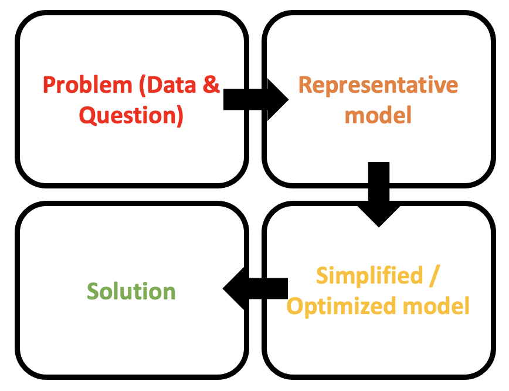

# Understanding the Problem

This documentation covers the public facing outputs of a discrete event simulation focussing on simulating the ambulance job cycle time.  The work has been made open to support:

- Reuse of the code-base by an analyst with access to ambulance data.  In this situation the code should be forked and adapted locally to ingest the trust specific data and trajectory.   We have attempted to include enough information around the parameters and inputs used to allow this refactoring to new data. 
- An example of using the open R library RSimmer for a healthcare discrete event simulation.  We have tried to include enough information around the approach and considerations to be useful for wider simulations. 

## Context of the Specific Simulation

Ambulance handover problems have been dominating the Urgent & Emergency Care (UEC) space. Over the past couple of years there have been large handover delays, with a lot of people waiting a long time to be admitted into the emergency department (ED). 

    
    

### Understanding/Addressing the Problem

When a call is made, availability to respond to it depends namely on the number of on-duty ambulance fleet, the on-duty workforce but also the instantaneous availability to be allocated to that incoming call. This in turn depends on when on-duty ambulances can be cleared from previous jobs (finish their job cycle time from allocation to clearance). Handover delays are leading to more ambulances queueing at the hospital site and an increase in job cycle time, which affects their availability for subsequent jobs.

Much of it may not be in the sole direct gift of the ambulance service, as ability to handover depends on A&E availability for clinical handover, which may in turn be affected by, successively: A&E occupancy, bed availability in admitted patient care, inpatient discharge (to home, social care, …).
It is useful though to better understand the ambulance setting and how different factors affect performance. Namely, the relation between handover delays and response times, the impact of resourcing models, changes to job cycle time or fluctuations in demand.

## Problem Statement to be Modelled

In the context of ambulance to emergency department handover delays and elevated ambulance response times, build a prototype discrete event simulation model (DES) for the ambulance setting to help understand the potential impacts of:

* resourcing interventions
* factors such as demand, job cycle time components, vehicle capacity

on:

* ambulances queueing at hospital site
* calls queued
* call response times
* handover times

An overview of the response time problem restated as a queue is given below. Queues for ambulances to handover at the site can also emerge.

    

## Methodological Approach - Discrete Event Simulation

As the dynamics to be modelled are flows and resource utilisation, a system model is required.  As we are interested in understanding the profiles tails and not just the medians and expected to include individual effects in the model (e.g. reneging and queue prioritisation depending on individual characteristic) a Discrete Event Simulation (DES) is considered.  This approach models systems as networks of queues and activities, where state changes in the system occur at discrete points embedded in continuous time.  This means that many system events can happen in a single time point, one after another, followed by many time points where no update occurs. The objects in the system are distinct individuals, each possessing characteristics that determine what happens to that individual, and the activity durations are sampled for each individual from probability distributions.  Discrete Event Simulations are essentially stochastic in nature.  

This method has the advantage of intuitive and visual checks to the logic model, scenario testing and granular modelling.  The restrictions of DES are mainly around the simplified model of the system not picking up dynamic behaviours.  This means that absolute values should not be used for direct comparisons with reality but instead to inform a discussion of the underlying causalities and impacts of changes on the system.

Discrete event simulations have been widely used for a long time across a variety of industries including queuing logic (e.g. airport customs), assembly lines (e.g. return on investment from prioritising one product line over another), and resource management (e.g. operating theatres).  

Other techniques that could be considered for this work are: queuing theory; Markov chains; process mapping; or system dynamics.

## Model Design

A successful system model needs to have:

- Well-defined scope
- Available Data flows at the right level of granularity
- Known unknowns with evidenced-based assumptions
- Separate validation metrics
- Benchmarks if possible

In order to build a model that will have longevity, can be worked on by multiple individuals and where components can be reused in future projects we have pushed for a version controlled, free and open source solution.  

A key learning from previous related projects is that there is often a strong desire to jump from the problem to the solution.  Instead we must ensure to work through two additional stages of considering a representative model and creating from this a simplified / optimized model to generate the solution from. 

    

The rest of this documentation will be split across these four steps. 