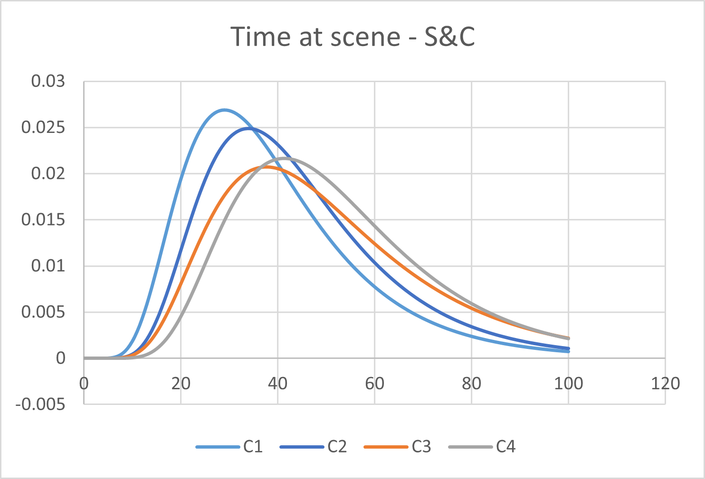

## Overview

The core model inputs can be mainly grouped into the following:

- Demand and flow
    - Ambulance demand (t)
        - volume (t)
        - by category (t)
        - by care model
        - by conveyance destination
    - Direct demand (t)
- Supply (t)
    - Ambulance supply (t)
    - ED supply (t)
- Job Cycle Time components
    - Time to scene
    - Time at scene
    - Time to site
    - Unavoidable pre-handover
    - Time to clear
    - (nb: Time to Allocate and Time to Pre-handover (Avoidable) are not user inputs, they are emerging outputs from the model given demand and supply)
- ED Management
    - ED acuity for Direct ; ambulance category
    - ED time in department

The `(t)` indicates which ones can be given by the user in a time-resolved (hour-by-hour) way.

## Configuration of inputs in the code

While `inputs.R` is the main script for loading in Input parameter files for model run purposes, this file would typically **not** be updated by an end-user, with all user updates being done in the Input parameter files themselves (within `./parameter/__/`) and `config.R`.

## Overview by type

The resulting Inputs for demand, supply, and timings were taken from the identified data sources.
Below some examples are given (though other options are possible).

For a more detailed walk-through on the use of Parameter Input Files, see [User guide - Parameter input files](userguide.md).

For a more detailed walk-through of `config.R`, see [User Settings (Config)](config.md).

### Demand - Hourly Schedule
The demand schedule is made up of a dataframe which covers hourly arrivals for:

- Number of ambulance incidents (calculated from hourly and weekday proportions of actual number of incidents from selected geography in selected time period)
- Number of direct ED walk-in demand (calculated from hourly and weekday proportions of uplifted number of incidents by a factor of 1.736)

Note: other options available, see [User guide - Parameter input files](userguide.md).

### Demand and Flow - Category

When patients are generated as demand in the model, they are assigned a category.
This can be set as either time-variant or time-invariant.

Time-variant:

- Proportion of Category1 ambulances (calculated from actual numbers of cat 1 ambulance calls multiplied by hourly profiles)
- Proportion of Category2 ambulances (calculated from actual numbers of cat 2-4 ambulance calls multiplied by hourly profiles and category proportion)
- Proportion of Category3 ambulances (calculated from actual numbers of cat 2-4 ambulance calls multiplied by hourly profiles and category proportion)
- Proportion of Category4 ambulances (calculated from actual numbers of cat 2-4 ambulance calls multiplied by hourly profiles and category proportion)

Time-invariant:

### Demand and Flow - Model of Care

Patients are assigned a care model depending on their category.

### Demand and Flow - Category

Patients needing conveyance are assigned a conveyance destination (ED or non-ED).

### Demand and Flow - ED Acuity

Patients are allocated an acuity based on their route to ED and category

### Job Cycle Time
The inputs for the Job Cycle Time Components can be chosen as either Quantile-based or Stylistic parametrisation-based.

The relevant components are:

- Travel to scene
- Time at scene
- Travel to site
- Unavoidable pre-handover
- Time to clear
- _(pre-handover and time to allocate are emerging queuing model characteristics, not inputs)_

Fig. Example input "Time at Scene" JCT component (Quantile-based). For ‘See and Treat’ incidents, divided by categories.

Fig. Example input "Time at Scene" JCT component (Stylistic-based). For ‘See and Convey’ incidents, divided by categories.

### Supply- Hourly Schedule
The supply schedule is made up of a dataframe which covers hourly resources available for:

- Number of double staffed vehicles (DSV/DSA) (calculated from hourly and weekday proportions of actual number of ambulances available from selected geography in selected time period)
- Relative hourly ED supply (calculated from hourly, weekday and week-on-week relative proportions)

Note: other options available, see [User guide - Parameter input files](userguide.md).

