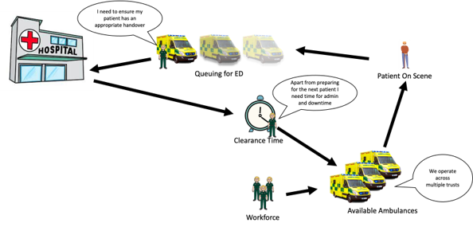

# AmbSim - Project Scope
This project ran over the course of 12 weeks in Winter/Spring 2023.

## Background 
Ambulance handover problems have been dominating the Urgent & Emergency Care (UEC) space. There are currently large handover delays, with a lot of people waiting a long time to be admitted into the emergency department (ED). 

The UEC recovery plan has been [published](https://www.england.nhs.uk/publication/delivery-plan-for-recovering-urgent-and-emergency-care-services/) . Within it, among other measures, it sets out a [boost in capacity via the ambulance fleet over a two year period](https://www.bbc.co.uk/news/health-64448354). 

## Exam Question

> What happens to Ambulance handover times / delays, and, ambulance response times, if you increase the number of ambulances within a system? As well as looking at changes in mean performance, we’d also want to look at the distribution, and peaks.

## Graphical Representation
When a call is made, availability to respond to it depends namely on the number of on-duty ambulance fleet and the instantaneous availability to be allocated to that incoming call.  This in turn depends on when on-duty ambulances can be cleared from previous jobs (finish their job cycle time from allocation to clearance). Handover delays are leading to more ambulances queueing at the hospital site and an increase in job cycle time, which affects their availability for subsequent jobs.

    

The system to be modelled includes patient demand for A&E split into categories and conveyance routes.  Ambulances are allocated from a changing supply and act out a process time split into several “job cycle time” stages.  Some patients will not be conveyed to A&E but instead have a “see and treat” model osf care.  Those arriving at A&E will queue for a bay alongside the direct walk-ins before being allocated a bay for a set amount of time. 

## Approach
Suggest using the open source R package RSimmer building off the back of previous [ambulance DES](https://github.com/nhsx/ambulance-DES) work.  SimPy was also considered but previous related work has been done in RSimmer and SimPy requires a significant setup time to create the simulation objects and logging.  A Large range of Licensed software was also considered but it is preferable to work in software which is more collaborative and we don't imagine needing the additional functionality that the licensed software brings for this task. 
