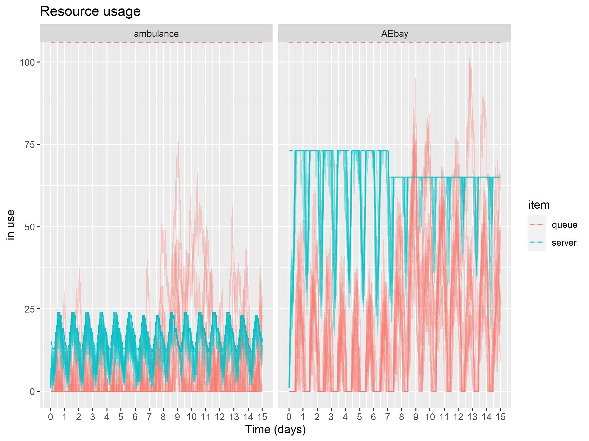
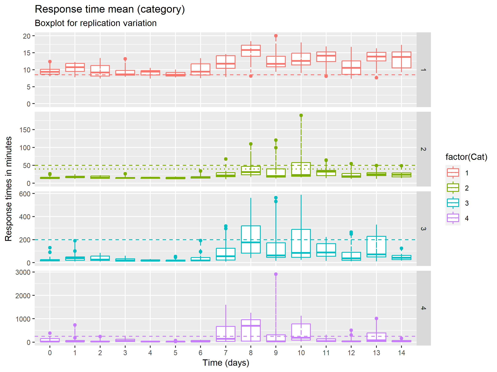
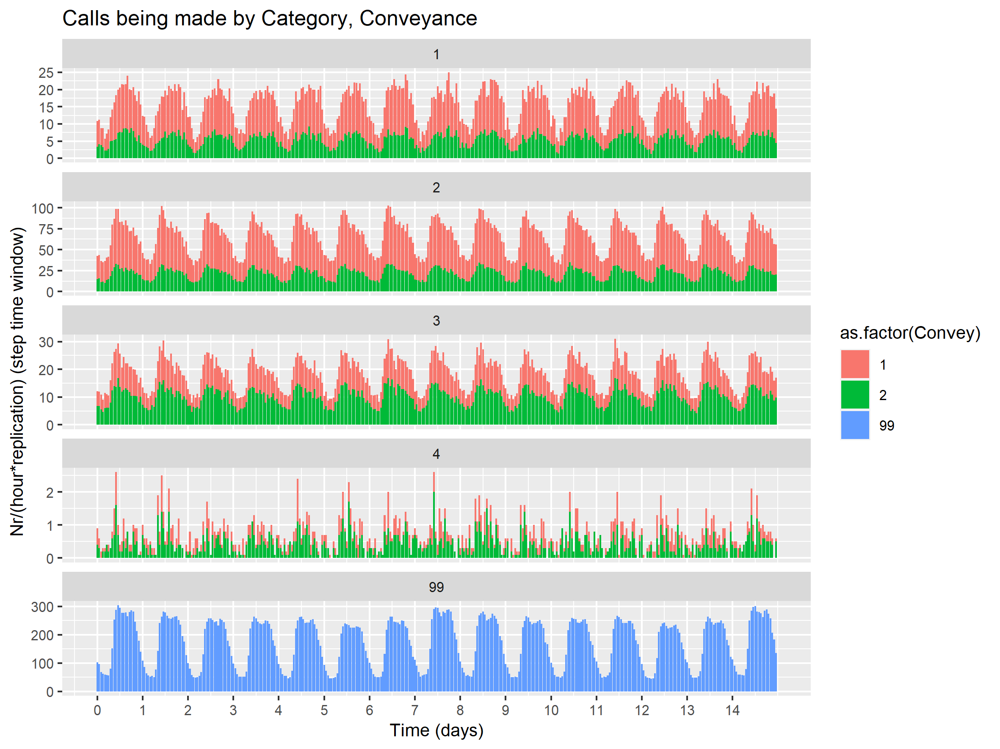
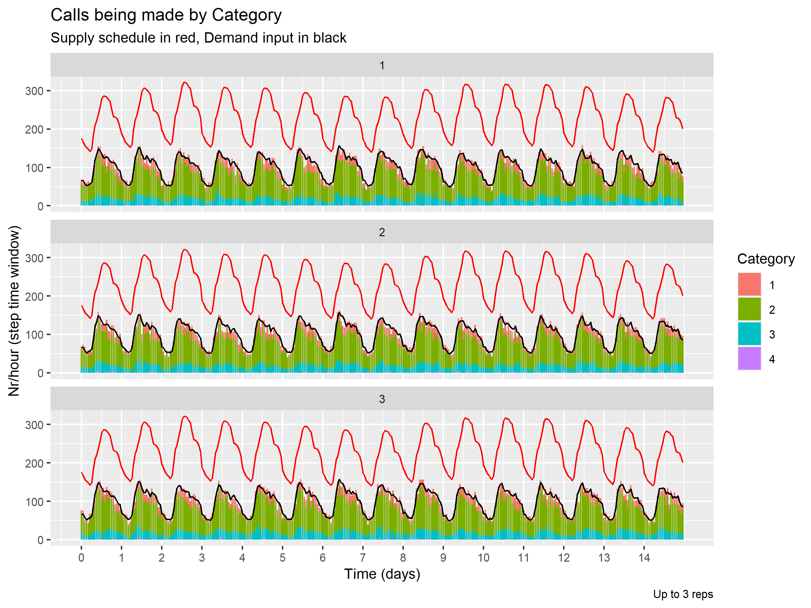
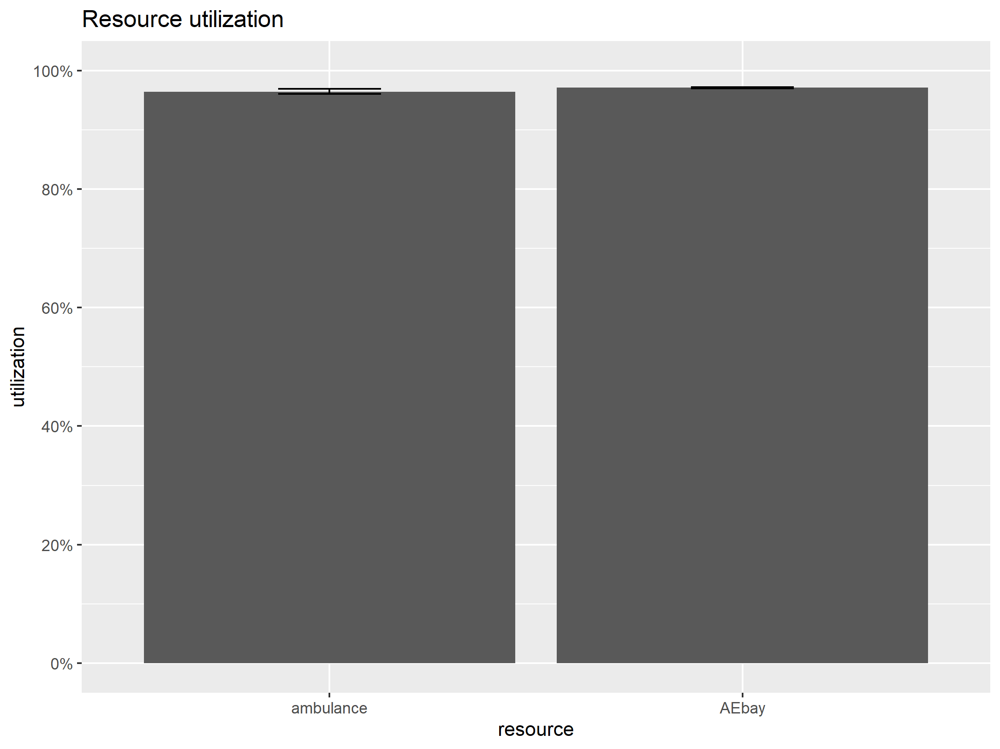
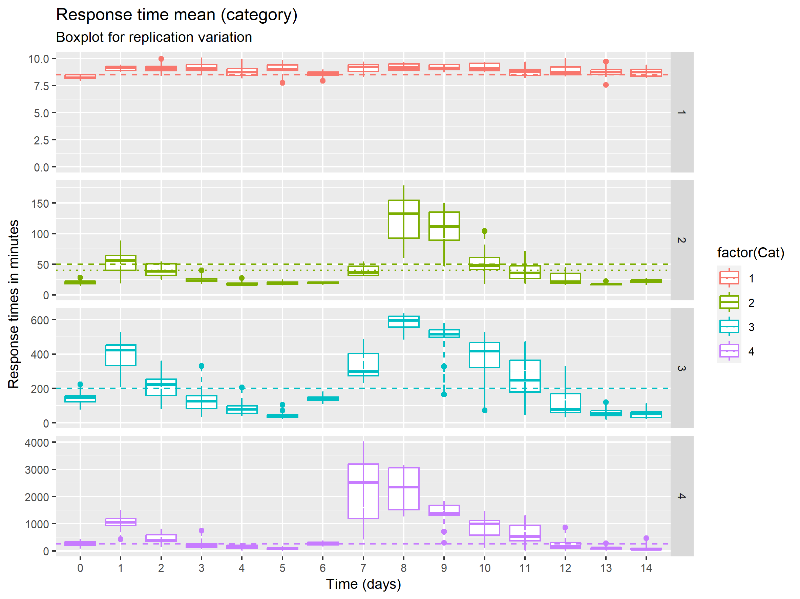
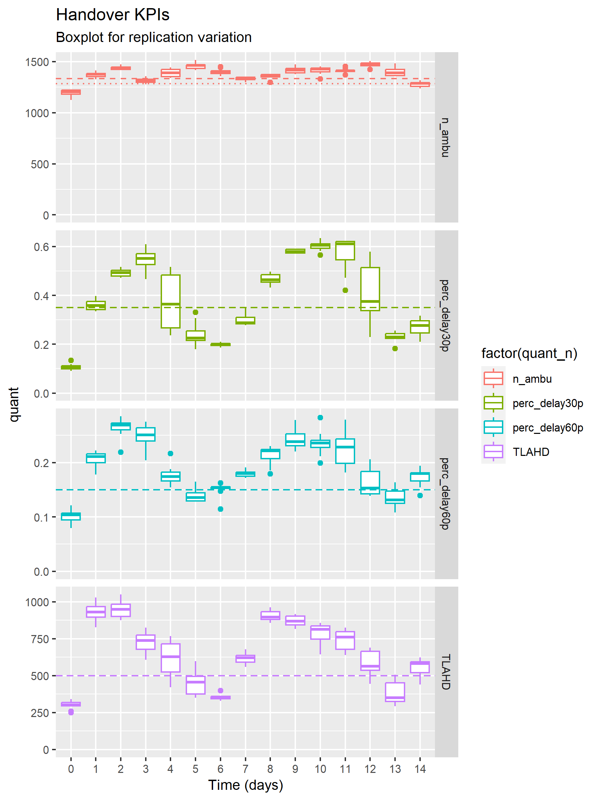
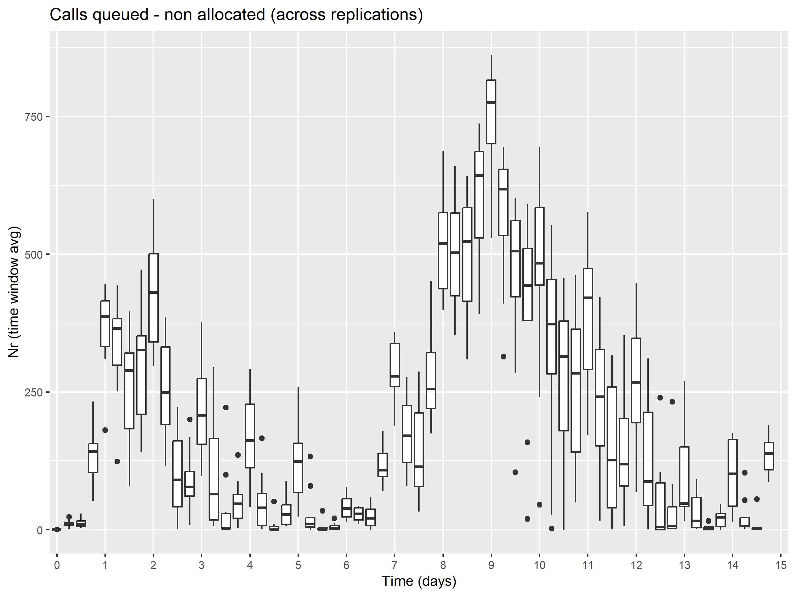

> **Note**
> Internal NHSE documentation for the results of Phase 1 of the work (March-April 2023) and Phase 2 of the work (April-May 2023) not made public.
> Outputs from the Toy / Fake scenarios shown below to exemplify outputs.

The "foundation" outputs of the model are the Log of Arrivals (log_arrivals.xlsx) and the Log of Attributes (log_attributes_w.xlsx).

These will be saved if `flag_savedata_fulllogs <- TRUE` in `config.R` (a reason to set this to False may be avoiding to save large files unnecessarily).

All relevant graphical visualisations and summary metrics can likely be created from these.

The script `post-processing.R` already has specified and produces a range of outputs based on those logs, both in table and visual format. These are shown below.

Alternatively, the end-user is free to do their own post-processing with the logs given.

## Example outputs from Fake_Data_1A

This pre-created scenario uses a fictitious set of parameters for demand, capacity and job cycle times for a smaller scale toy example.
It creates a step disruption in A&E bays available from the 8th day (reducing bays by 8, from 73 to 65).

Example outcomes from `parameters/Fake_Data_2/` scenario , with `n_AEbays <- 73`, `T_AE <- 6.5`, `flag_LoS_file <- TRUE`, `dn_AEsupplyshock <- -8`.
Outputs can be seen in `example_outputs/Fake_Scenario2_1`.

### Demand and Capacity

**Figure** Red traces represent queues forming. Continuous blue traces represent occupancy, with dashed blue traces showing capacity. The multiple traces relate to the 10 replications run. After 7 days, a disruption is imposed by reducing A&E bays. The effect of this on queues, both for the A&E bays and for the upstream ambulance activity, can be seen.

### Response time KPIs

**Figure** Mean response time KPIs per category and per simulation time-steps. Boxplots showing inter-replication variation. Dashed line is dummy, can be used to benchmark.

### Handover KPIs

**Figure** Handover KPIs per simulation time-steps. Boxplots showing inter-replication variation. Dashed line is dummy, can be used to benchmark.

### Events and pathway visualised

> **_NOTE:_** Contrary to the other outputs shown, for the code used to generate these static and animated pathways, please refer to our Process Mining repository [TBA]. Subfolder [TBA] shows scripts for this AmbModelOpen use case.

#### Pathway 'mean times' and branching % - week 1 vs week 2

[Week 1 (before disruption) - % per branch](../assets/Fake_Scenario_1A/map-all_relativerep1id1_2023-10-20.html)

[Week 1 (before disruption) - mean time](../assets/Fake_Scenario_1A/map-all_meanrep1id1_2023-10-20.html)

[Week 2 (ongoing disruption) - % per branch](../assets/Fake_Scenario_1A/map-week2all_relativerep1id1_2023-10-23.html)

[Week 2 (ongoing disruption) - mean time](../assets/Fake_Scenario_1A/map-week2all_meanrep1id1_2023-10-23.html)

#### Pathway animated - first week (before disruption)

This animation only relates to days 1-7, so before step disruption. Calendar dates are fictitious. Colours relate to care model.

Embedded below or seen in full screen [here](../assets/Fake_Scenario_1A/map-anim_all_absolute_crep1id1_2023-10-20_self.html).

<iframe src="../assets/Fake_Scenario_1A/map-anim_all_absolute_crep1id1_2023-10-20_self.html" width="800" height="600"></iframe>

#### Pathway animated - scenarios with and without disruption

This animation is similar to the previous one, but animates for the two weeks. Also, the top branch (`B-Base scenario`) shows the case where no disruption occurs at all. The bottom branch (`D-Disrupted scenario`) shows the case where step disruption occurs from day 7. Colours relate to breaches (of either category2 response time at 90th %ile, handover of 30+ minutes or both).

Embedded below or seen in full screen [here](../assets/Fake_Scenario_2B/map-anim_cat2_absolute_crep1id1_2023-07-04_self.html).

<iframe src="../assets/Fake_Scenario_2B/map-anim_cat2_absolute_crep1id1_2023-07-04_self.html" width="800" height="600"></iframe>

## Example outputs from Fake_Data_2

This pre-created scenario uses a fictitious yet realistic set of parameters for demand, capacity and job cycle times for a toy ambulance trust.

Example outcomes from `parameters/Fake_Data_2/` scenario , with `n_AEbays <- 1500`, `T_AE <- 6.5`, `flag_LoS_file <- FALSE`, `dn_AEsupplyshock <- 0`.
Outputs can be seen in `example_outputs/Fake_Scenario2_1`.

### Demand

**Figure** Demand per category and conveyance (colour-coded ; 1 - see and convey; 2 - see and treat; 3 - hear and treat; 99 - direct ED)

### Demand and supply

**Figure** Incident demand per category (colour-coded ; categories 1-4). 3 replications shown. Direct ED demand excluded. Black trace - input demand. Red-trace - input DSV supply

### Resource utilisation KPIs

#### Instantaneous utilisation, capacity and queue traces

**Figure** Instantaneous resource usage for respectively ambulance and A&E bay. Dashed blue - server capacity ; Solid blue traces - server use ; Solid red traces - queues . Multiple traces due to n=10 replications.

#### Utilisation KPIs - batch, overall simulation time

**Figure** Utilisation and queue for A&E bay and ambulance. Average and standard deviation.

### Response time KPIs

**Figure** Mean response time KPIs per category and per simulation time-steps. Boxplots showing inter-replication variation. Dashed line is dummy, can be used to benchmark.

**Table** Response time KPIs (mean, median, 90th) averaged across simulation time and replications (mean, standard deviation)

[KKPIbatch_overall_RTcat.xlsx](./assets/Fake_Scenario_2/KPIbatch_overall_RTcat.xlsx)
<!--- {{ read_excel('./assets/Fake_Scenario_2/KPIbatch_overall_RTcat.xlsx', engine='openpyxl') }} --->

### Handover KPIs

**Figure** Handover KPIs per simulation time-steps. Boxplots showing inter-replication variation. Dashed line is dummy, can be used to benchmark.

**Table** Handover KPIs averaged across simulation time and replications (mean, standard deviation)

[KPI_overall_HO.xlsx](./assets/Fake_Scenario_2/KPI_overall_HO.xlsx)
<!--- {{ read_excel('./assets/Fake_Scenario_2/KPI_overall_HO.xlsx', engine='openpyxl') }} --->

### Select Job Cycle Time KPIs

**Table** KPIs 'Time to allocate' , 'Time for pre-handover', 'Total job cycle time', 'Response time', per conveyance. Mean and median.

[KPI_overall_val_conv.xlsx](./assets/Fake_Scenario_2/KPI_overall_val_conv.xlsx)
<!--- {{ read_excel('./assets/Fake_Scenario_2/KPI_overall_val_conv.xlsx', engine='openpyxl') }} --->

### Call queue KPIs

**Figure** Average call queue KPI per simulation time-steps (6 hour window). Boxplots showing inter-replication variation.

### (Hospital) site queue KPIs

**Figure** Average site queue KPI per simulation time-steps (24 hour window). Boxplots showing inter-replication variation.

