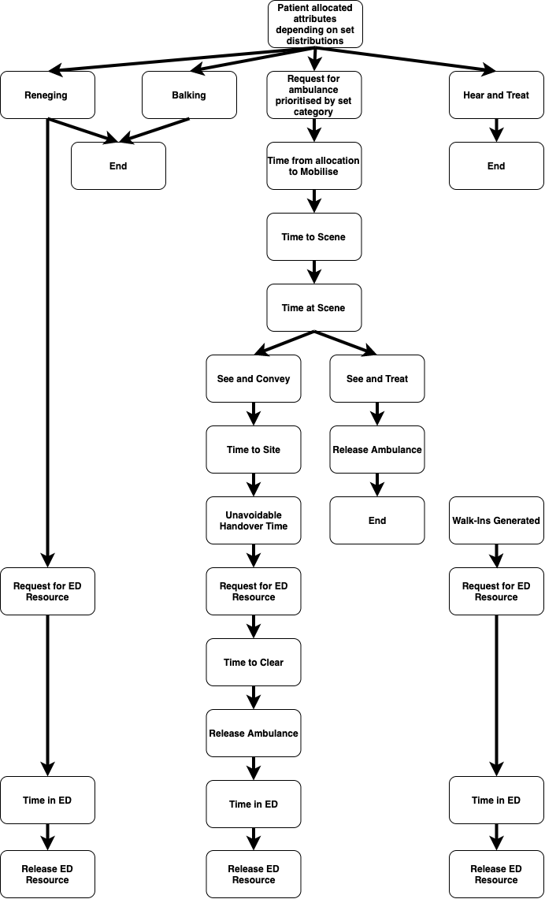

> **Warning**
> IN CONSTRUCTION.

The model is run as a discrete event simulation using the [RSimmer package](https://r-simmer.org/).  This type of modelling requires a "trajectory" to be fed with a realistic demand which then moves through the trajectory based on evidence based assumptions and resource supply usage.  The time it takes for the demand to make its way through the system and the utilisation of resources required for this can be monitored.  Each of these components will be explain in more detail below. 

## Trajectory

For this problem we can state that there is a fairly consistent patient pathway or "trajectory" as patients enter the system through a 999 triage process, are allocated ambulance resources which have fairly consistent job cycle times and then are either treated at scene, conveyed to and ED or conveyed to a non-ED setting.  At the ED setting there may be the formation of a queue whilst handing over the patients.  This creates a relatively simple trajectory but one where the time delays and resource prioritisation are heavily impacted by other parts of the system.

    

## Demand

The demand in this model comes from two main generators:

- Walk-ins (i.e. direct ED attendances)
- Ambulance incidents

In this model, walk-in demand can vary over time (hourly). It can be attributed different levels of ED acuity, which will impact the way requests for ED resource (among themselves and in relation to ambulance demand) are prioritised.

Ambulance incident demand can vary over time (hourly). The distribution of this demand by category can also vary hourly. Each ambulance incident will be attributed a certain care model. If this involves conveyance, the incident will be attributed a certain probability that conveyance is to ED. If conveyance is to ED, it will be attributed a given ED acuity. 

## Resource Usage

The resources in this model are of two types:

- Double staffed vehicles (also known as double crewed ambulances)
- ED bays (a simplified resource unit for ED)

Walk-ins will only compete for ED bay resource.

Ambulance incident demand will compete for ambulance resource (unless they are Hear&Treat or balk or renege). They will also compete for ED bay resource if the care model is See&Convey.

The priority for ambulances is determined by the category (1= highest; 4=lowest), though a mechanism is in place that if lower priority categories have waited a long time, they may have their priority increased.

The priority for ED bays is based on ED acuity and a further calibrating parameter.

## Model capabilities

The current model can:

- Set ambulance demand by hour, weekday and category with competitive walk-in demand for ED
- Set ambulance supply by hour and weekday
- Set ED bay supply by hour and weekday
- Set a renege time for patients to leave queue after a certain time (to simulate situation improving whilst waiting)
- Set balking criteria (to simulate patients taking themselves or using other services)
- Vary category three conveyance dynamically based on pressures i.e. increase the sea and treat proportion associated JCT components dynamically (to simulate changing behaviour of the ambulance allocations) 
- Set more than one resource allocated and arriving at scene, per incident
- Set a portion of supply as ‘holdout’ for Category one only, always or as a trigger
- Escalate Category three and four calls if they have been waiting for more than X time (to simulate a balance in queue priority of category versus time waited)
- Set different time in ED department in the ED by category and source (direct vs ambulance)
- Simulate over 14 days for realistic levels of demand
- Monitor the utilisation of resources and the queues waiting for these resources
- Generate KPIs on response time, handover delays, queues and job cycle time components
- Run the simulation up to 3-25 times with different seeds in the time and allocation profiles.
- Run multiple scenarios / sensitivities in a loop and compile results

The current model can't `*`:

- Escalate resources depending on time or simulation metrics (triggers)
- Vary behaviour of ED prioritisation based on pressures.
- Vary non face to face % dynamically based on pressures.
- Account for multiple EDs explicitly.
- Set rapid response vehicles as resource alongside double crewed ambulances.

`*` these can functionality-wise be implemented in Simmer/DES. A consideration of added-value to accuracy, added-value to decision-making and feasibility may determine which ones would be useful to implement. Where feasibility is a barrier this may mainly relate to knowledge of behavioural/escalation mechanisms and parametrisation.

## Assumptions

An overview of key assumptions:

- The effect on clinical outcomes is assessed via other approaches.
- Sociodemographic considerations are assessed via other approaches.
- The model is used for what-if scenarios rather than for forecasting or an absolute depiction of the as-is.
- 999/111 calls that do not become incidents are out of scope.
- Demand, capacity, distribution by category can be set as time-variant. Conveyance and demand (via balking, reneging) can be set to change dynamically. Other inputs are time-invariant.
- Ambulance resource is characterised through double crewed ambulances.
- The ED department, while not in core scope, is modelled at high level as a capacity-constrained resource with a certain time in department.
- Flow beyond the ED department is out of scope, while aknowledging the influence of such settings on upstream settings by developing what could be a module in a modular simulation.
- A useful model on the effect of interventions on response times and handover delays can be obtained without a fully geospatial or multiple-ED approach .
- **TBA**