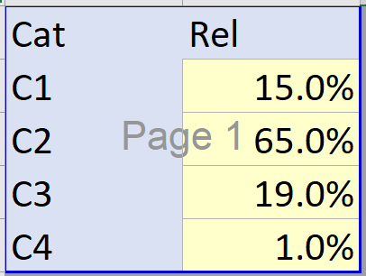
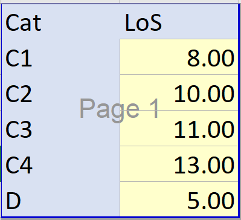
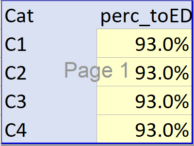

# Parameter Input files for demand, supply, JCT

All file based parameters should be updated in a newly created folder within `/parameters` .

The folder `Fake_Data_2` can be copied and renamed (e.g. to `NewRun`). This gives a pre-filled starting point from which assumptions can be changed as deemed fit.

To use this parameter folder, in `main.R` update `scenario_folder` as appropriate, i.e. `scenario_folder<-"NewRun"`.

Note that whether individual files and parameters within the folder are loaded and used in the DES model runs will depend on whether relevant flags or controls have been turned on (e.g. in `config.R`). This is highlighted below for the relevant sections.

## Constituent parameter input files of a scenario folder

The model expects the following parameter input files to be present in the folder:

- `JCT_v_type.xlsx` - file to specify whether JCT components are set based on quantiles or stylistic (parametric) distributions.
- `JCT_m_q.xlsx` - file that specifies the distributions for JCT components based on quantiles, by category and model of care.
- `JCT_m_style.xlsx` - file that specifies the distributions for JCT components based on stylistic distributions (constant or lognormal).
- `m_demand_cat2conv.xlsx` - file that specifies demand by category ; model of care by category ; time in A&E department ; ED acuity by category or direct attendance; % conveyance to ED.
- `v_DnC_schedule.xlsx` - file that specifies demand (ambulance, direct) and capacity (double staffed vehicles, ED) profiles over time.

## Input file 'm_demand_cat2conv.xlsx'

This file allows for a series of inputs to be given, mostly related to relative distributions in demand.

Tab `Checks` will perform some checks to ensure data is internally consistent and coherent. Flags will indicate if there are issues.

Tab `Sources` can be used to log the origin of the data.

Each other tab will allow the parametrisation of a different relation.

### Provide the relative model of care by acuity

- Navigate to sheet 'm_demand_cat2conv'
- In the matrix, provide for each Category the relative distribution of demand by model of care (SeeConvey vs SeeTreat vs Hear Treat).
- **Good to know**:
    - Each row should add to 100%.
    - Each value should be between 0-100%
- **Suggested sources**: AmbSYS ; daily ambulance collection
- **Run use**: will be used; MUST define

### Provide the relative acuity

- Navigate to sheet 'v_demand_cat'
- In the matrix, provide the relative distribution of demand by category.
- **Good to know**:
    - The column should add to 100%
    - Each value should be between 0-100%
- **Suggested sources**: AmbSYS ; daily ambulance collection
- **Run use**: will be used and MUST be defined _unless_ in parameter file `v_DnC_schedule.xlsx` sheet `Controls`, the user has set `Should category distribution vary over time?` to `Yes`.

### Provide the Time in Department by category

- Navigate to sheet 'v_LoS'
- In the matrix, provide the Time in Department by Category (hours).
- **Good to know**:
    - Each value should be greater than 0.
- **Suggested sources**: ECDS time in department; ECDS-NACC linkage; judgemental
- **Run use**: will be used only if in `config.R` file `flag_LoS_file<-TRUE` . Otherwise model run will use as specified in `config.R` `T_AE` (`flag_scenarios=FALSE`) or `vec_T_AE` (`flag_scenarios=TRUE`).

### Provide the relative Conveyance Destination

- Navigate to sheet 'v_conveydestination'
- In the matrix, provide the % of those conveyed that go to ED (as opposed to non-ED)
- **Good to know**:
    - Each value should be between 0-100%
- **Suggested sources**: AmbSYS ; daily ambulance collection
- **Run use**: will be used and MUST be defined.

### Provide the direct ED demand as a ratio of ambulance conveyance demand

- Navigate to sheet 'v_direct_ratio'
- In the cell, provide the ratio of ED direct attendance relative to ambulance conveyance. That is, for each ambulance conveyance, how many ED direct attendances are there.
- **Good to know**:
    - The value should be non-negative.
- **Suggested sources**: ECDS attendance source
- **Run use**: will be used and MUST be defined _unless_ in `config.R` the `flag_demand_schedule <- TRUE`, in which case it will load the direct demand trendline from `v_DnC_schedule.xlsx`.

### Provide the relative ED acuity by Category (and Direct)

- Navigate to sheet 'v_direct_acuity'
- In the matrix, provide for each Category (and Direct) attendances, the relative distribution of ED acuity.
- **Good to know**:
    - Each column should add to 100%
    - Each value should be between 0-100%
    - Acuity dictates priority of ED handover in the model (dealing with "competitive" nature of direct vs ambulance attendances for resource)
- **Suggested sources**: ECDS acuity, ECDS-NACC linkage, judgemental / calibration of handover delays
- **Run use**: will be used and MUST be defined.

## Input file 'JCT_m_type.xlsx'

The period for different Job Cycle time components can be defined in two main ways:

- As Quantiles, i.e. establishing that X% of events occur under a timeperiod of Y, for a range of X values.
- As Style, i.e. as a stylised parametric distribution - currently this can be either a constant or a lognormal.

This file requires the user to specify from the dropdown which type they would like to use for each JCT component. This will in turn dictate, for each respective JCT component, from which workbook the information will be loaded and applied during the run (`JCT_m_style.xlsx for Style ; JCT_m_q.xlsx for Quantiles).

Header meaning:

- tts - time to scene
- tas - time at scene
- ttsi - time to site
- uph - unavoidable pre-handover (defining the minimum handover, independent and on top of that emerging from the model's handover ED resource request)
- ttc - time to clear

## Input file 'JCT_m_q.xlsx'

- Each sheet refers to a different JCT component.
- The configuration of each sheet is the same.
    - Yellow cells need filling.
    - It expects the user to provide, in minutes, the {1,10,20,30,40,50,60,70,80,90,99}th %ile (q) of that component. This can be used by the DES model to sample time intervals from for each patient.
    - Four columns are given, one per category.
    - Row-wise (long-format), data can be given for 3 care models (CM=1 is see and convey; CM=2 is see and treat; CM=3 is hear and treat).
    - In practice this means that separate distributions can be given by component x category x care model.
- **Good to know**:
    - Each value should de greater or equal to zero
    - Each quantile vector q from 1%ile to 99%ile should be increasing in monotony - i.e. it would not make sense for the value to drop.
    - In practice, CM=3 has no meaning for any of the JCT components (hence cells in blue in all sheets).
    - In practice, CM=2 has no meaning beyond `timeatscene` (hence cells in blue in the following sheets)
- **Suggested sources**: JCT components informed by CADS / ADS ; model ambulance in model health system; judgemental.
- **Run use**: will be used and MUST be defined _if_ 'Quantiles' selected in `JCT_m_type.xlsx`.

## Input file 'JCT_m_style.xlsx'

- Each of the first five sheets refers to a different JCT component. 

- The configuration of those sheets is the same.
    - Yellow cells can be filled as needed.
    - The purpose of each sheet is to parametrise the distribution of that JCT component based on a parametric distribution, via a 'param' vector. Currently, the following two have been implemented and would be recognised by the DES model (could be expanded):
        - 'rlnorm' - lognormal
        - 'cons' - constant (fixed)
    - 'param' specification allows for 5 values, these should be used as follows (see also table below):
        - Use param5 to choose the distribution from the dropdown (rlnorm or cons)
        - If param5 is 'rlnorm':
            - param1 is the logmean
            - param2 is the logsd
            - param3,4 ignored
        - If param5 is 'cons':
            - param1 is the constant value / mean
            - param2,3,4 is ignored
        - The way parameters 1-4 are used is meant to be aligned with their use in packages such as [fitdistr](https://www.rdocumentation.org/packages/MASS/versions/7.3-58.3/topics/fitdistr).
    - Four columns are given, one per category. Row-wise (long-format), param is given for 3 care models (CM=1 is see and convey; CM=2 is see and treat; CM=3 is hear and treat). In practice this means that separate param specification are given by component x category x care model. Param for all relevant JCT components (sheet) x Care Model (row) x Category (column) should be specified.

    - Sheet `Checks` allows for some interpretation of the distributions - namely, via plotting and by showing what would be the expected mean and standard deviation of the resulting sample distribution.

    - Sheet `simple parametrisation` is a simple "aid" page in case the user would like to do the inverse operation, i.e. input a given observed sample mean and standard deviation and derive that the relevant parameters (e.g. logmean and logsd for the lognormal distribution) would be. This is at a very simple level. For more advanced distribution fitting from empirical data (either histogram-like or quantile-like, see auxiliary R script `utility_stylised.R`).

    - Sheet `Ref` provides some lookups, namely the meaning of the parameters for a given distribution (See Table below).

| param | constant(mean) | lognormal(logmean,logsd) |
|:-----:|:--------------:|:------------------------:|
| 1     | mean           | logmean                  |
| 2     | n/a            | logsd                    |
| 3     | n/a            | n/a                      |
| 4     | n/a            | n/a                      |
| 5     | cons           | rlnorm                   |

    
- **Good to know**:
    - In practice, CM=3 has no meaning for any of the JCT components (hence cells not in yellow).
    - In practice, CM=2 has no meaning beyond `timeatscene` (hence cells not in yellow in the following sheets)
    - `Checks` can be used to visualise resulting distributions ; `simple parametrisation` can be used to derive a rlnorm(logmean,logsd) from a desired sample mean and standard deviation; `utility_stylised.R` and its libraries can be used for more detailed investigations into appropriate distribution fitting.
- **Suggested sources**: JCT components informed by CADS / ADS ; model ambulance in model health system; judgemental.
- **Run use**: will be used and MUST be defined _if_ 'Style' selected in `JCT_m_type.xlsx`.

## Input file 'v_DnC_schedule.xlsx'

This file is used to give information on the demand and supply profiles. These are given as a time-series (time unit hour).

The information read and used by the DES model is that given in:

- Demand-Enforced
- Supply-Enforced

A couple of parameters are also read into R from 'Controls'.

Other sheets are largely auxiliaries to help the user populate those two main sheets.

### Sheet `Controls`

Largely, this sheets controls how `Demand-Enforced` and `Supply-Enforced` should be specified based on the background sheets.

- **Controls - Demand**
    - _Which profile: ' As_components' vs 'Fully custom'_ : choose whether ambulance incident demand should come from sheet `Demand - As_components` or from `Demand - Fully_custom`
    - _Which profile: 'uplift from ambulance incidents' vs 'Fully custom'_ : choose whether direct ED demand should come from sheet `Demand - As_components` or from `Demand - Fully_custom` or be a simple scalar applied to the ambulance incident demand
    - _Uplift factor_: Specify the uplift factor that should be used, if enabled. i.e. for every ambulance incident (upstream), how many direct ED attendances.
    - `Should category distribution vary over time?`: choose whether to ignore or not the category distribution over time in the DES model demand generator. If `Yes`, information in columns C1,C2,C3,C4 of `Demand-Enforced` will be leveraged in the DES model. If `No`, information in those columns will be ignored and instead the data in 'm_demand_cat2conv.xlsx' `v_demand_cat` (time-invariant) will be used.

- **Controls - Supply**
    - - _Which profile: ' As_components' vs 'Fully custom'_ : choose whether RSV and ED supply should come from sheet `Supply - As_components` or from `Supply - Fully_custom`

### Sheet `Demand-Enforced`

`Demand-Enforced` is ingested into the DES model to inform demand profiles. Its columns are filled based on information given in Controls and based on the `Demand _ [...]` auxiliary sheets.

- **Meaning:**

    - Day - day of the simulation
    - Hour - hour of the day in the simulation
    - Time - time in hours, starting at 0
    - Incident_Demand - incident demand in that hour (rate)
    - Direct_Demand - direct ED demand in that hour (rate)
    - C1, C2, C3, C4 - the relative portion of incident demand by category. These four columns should add to 100%

- **Good to know**:
    - Check that each time series makes sense, based on information given in `Control` and in the `Demand _ [...]` auxiliary sheets.
    - Check that `config.R` is set to ingest and leverage these, if so desired.
- **Run use**: will be used only if `flag_demand_schedule <- TRUE ` in `config.R` ; relative demand by category (C1,C2,C3,C4) only used if activated in the `Control` sheet of the same workbook.

### Sheet `Supply-Enforced`

`Supply-Enforced` is ingested into the DES model to inform supply profiles. Its columns are filled based on information given in Controls and based on the `Supply _ [...]` auxiliary sheets.

- **Meaning**:

    - Day - day of the simulation
    - Hour - hour of the day in the simulation
    - Time - time in hours, starting at 0
    - DSV_Enforced - DSV vehicles on-duty
    - ED_Enforced_torescale - a relative profile of ED capacity over time, the mean value of which is set in the `config.R` parameter `n_AEbays` (by standardising / rescaling the former)
    - Incident_Demand - (just used for plotting)
    - ED_enforced_plot_rescale - (just used for plotting)

- **Good to know**:
    - Check that each time series makes sense, based on information given in `Control` and in the `Supply _ [...]` auxiliary sheets.
    - Check that `config.R` is set to ingest and leverage these, if so desired.
- **Run use**: DSV schedule will be used only if `flag_supply_schedule <- TRUE ` and `flag_supply_schedule_file <- TRUE` in `config.R` . ED schedule will be used only if  `flag_supply_schedule <- TRUE ` and `flag_supply_schedule_file_hED <- TRUE` in `config.R` 

### Sheet `Demand - Fully_custom`

- Fill in information in the yellow cells.
- **Good to know**:
    - Column `Check` flags if columns C1, C2, C3, C4 add to 100%.
    - If this information should be used, check that `Controls` is currectly set up and that information is flowing into `Demand-Enforced`. See also the `Good to Know` from the `Demand-Enforced section`.
- **Suggested sources**:
    - For incident demand: ADS; CADS; daily ambulance collection
    - For direct ED demand and ratio: ECDS (attendances; admission source)

### Sheet `Demand - As_components`

- Fill in information in the yellow cells.
- For ambulance incident demand:
    - Fill the hourly demand component (this will be normalised)
    - Fill the weekly demand component (this will be normalised)
    - Fill the week on week demand component (absolute)
    - Fill the scaling factor
    - These factors are applied in a multiplicative way to generate a profile (column Incident_Demand and visualisations).
- For Direct ED demand:
    - Fill the hourly demand component (this will be normalised)
    - Fill the weekly demand component (this will be normalised)
    - Fill the week on week demand component (will be normalised)
    - The absolute scaling is dictated based in the `uplift_factor` in `Controls` and the aggregate ambulance demand.
    - These factors are applied in a multiplicative way to generate a profile (column DirectED_Demand_Demand and visualisations).

- **Good to know**:
    - If this information should be used, check that `Controls` is currectly set up and that information is flowing into `Demand-Enforced`. See also the `Good to Know` from the `Demand-Enforced section`.
- **Suggested sources**:
    - For incident demand: ADS; CADS; daily ambulance collection
    - For direct ED demand and ratio: ECDS (attendances; admission source)

### Sheet `Supply - Fully_custom`

- Fill in information in the yellow cells.
- **Good to know**:
    - If this information should be used, check that `Controls` is currectly set up and that information is flowing into `Demand-Enforced`. See also the `Good to Know` from the `Demand-Enforced section`.
- **Suggested sources**:
    - For DSV supply: NACC or judgemental or based on rotas
    - For ED supply: judgemental or based on rotas; SEDIT tool (consultants, nurses, bays)

### Sheet `Supply - As_components`

- Fill in information in the yellow cells.
- For double-staffed vehicle supply:
    - Fill the hourly capacity component (this will be normalised)
    - Fill the weekly capacity component (this will be normalised)
    - Fill the week on week on week capacity in vehicle hours (absolute)
    - Fill the scaling factor
    - These factors are applied in a multiplicative way to generate a profile (column DSV_Supply and visualisations).
- For ED supply:
    - Fill the hourly demand component (this will be normalised)
    - Fill the weekly demand component (this will be normalised)
    - Fill the week on week demand component (will be normalised)
     - These factors are applied in a multiplicative way to generate a profile (column `ED Supply to be rescaled` and visualisations).
    - The absolute scaling is not relevant. It will be dictated by the `config.R` parameter on average hourly A&E bay supply `n_AEbays`.

- **Good to know**:
    - If this information should be used, check that `Controls` is currectly set up and that information is flowing into `Supply-Enforced`. See also the `Good to Know` from the `Supply-Enforced section`.

- **Suggested sources**:
    - For DSV supply: NACC or judgemental or based on rotas
    - For ED supply: judgemental or based on rotas; SEDIT tool (consultants, nurses, bays)

